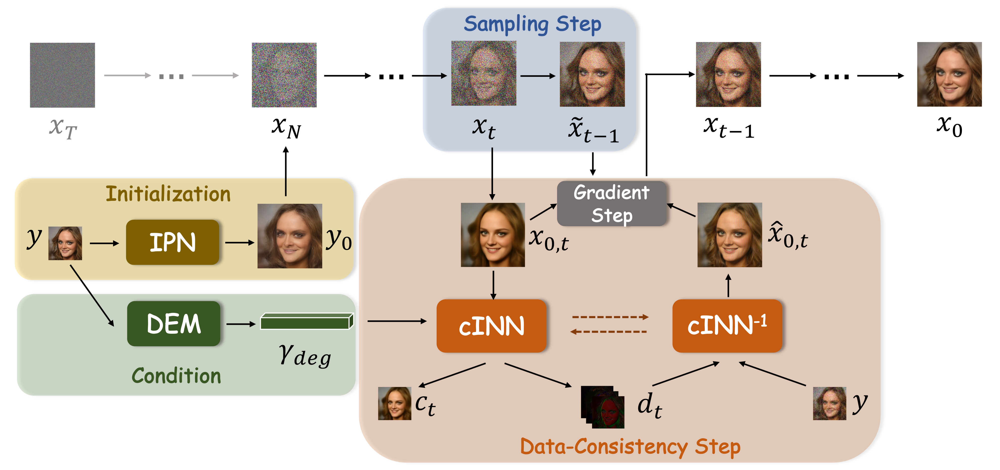
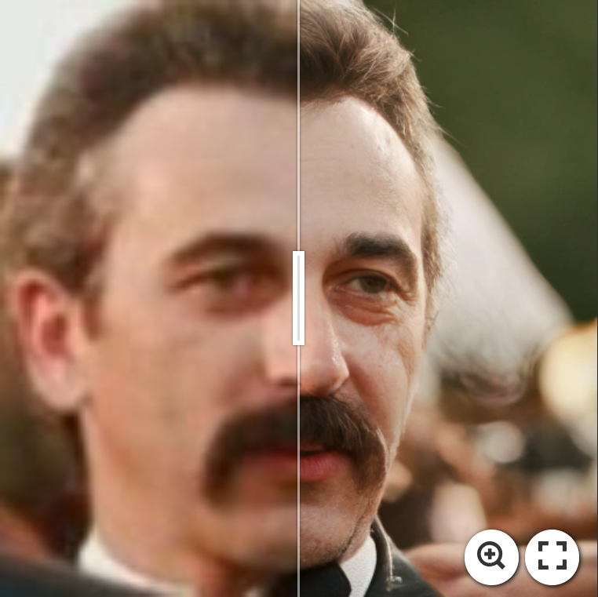
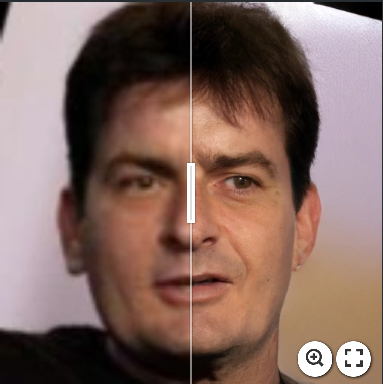
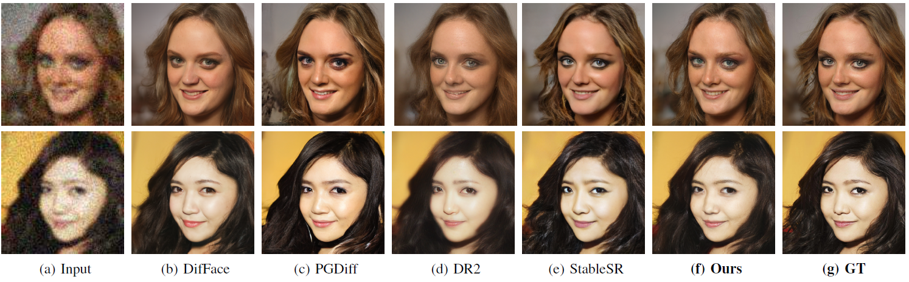

## INDIGO+: A Unified INN-Guided Probabilistic Diffusion Algorithm for Blind and Non-Blind Image Restoration (JSTSP 2024)


Di You | [Pier Luigi Dragotti](https://scholar.google.com/citations?user=5lDS3CcAAAAJ&hl=zh-CN)

Imperial College London

This repository is the official PyTorch implementation of the paper [INDIGO+: A Unified INN-Guided Probabilistic Diffusion Algorithm for Blind and Non-Blind Image Restoration (JSTSP 2024)](https://ieeexplore.ieee.org/document/10670023)
## Overview framework


## Experimental Results
[](https://imgsli.com/Mjk1Mzgy)
[](https://imgsli.com/Mjk2Mzc4)


## Dependencies and Installation
```
conda env create -f environment.yaml
conda activate indigo
```

## Inference
Download the pretrained INN models and testing data from [GoogleDrive](https://drive.google.com/drive/folders/1kglZ40RsjoetBXqSR0AHu7aNLXAqpPaQ?usp=sharing). 
The pretrained models for [Diffusion model and SwinIR](https://github.com/zsyOAOA/DifFace/tree/master) will be downloaded automatically.
```
python inference.py \
-i [INPUT_DIR]  -o [RESULT_DIR]  --task restoration \
--eta 0.5 --aligned  --use_fp16 \
--config_indigo configs/sample/indigo_syn.yaml
```

```
python inference.py \
-i [INPUT_DIR]  -o [RESULT_DIR]  --task restoration \
--eta 0.5 --aligned  --use_fp16 \
--config_indigo configs/sample/indigo_real.yaml
```

## Contact
If you have any questions, please feel free to contact: `dy22@ic.ac.uk`

## Citations
If our code helps your research or work, please consider citing our paper.
The following are BibTeX references:

```
@ARTICLE{10670023,
  author={You, Di and Dragotti, Pier Luigi},
  journal={IEEE Journal of Selected Topics in Signal Processing}, 
  title={INDIGO+: A Unified INN-Guided Probabilistic Diffusion Algorithm for Blind and Non-Blind Image Restoration}, 
  year={2024},
  volume={},
  number={},
  pages={1-15},
  keywords={Degradation;Image restoration;Diffusion models;Noise;Training;Image reconstruction;Noise measurement;Blind image restoration;diffusion models;image restoration;invertible neural networks},
  doi={10.1109/JSTSP.2024.3454957}}
```
